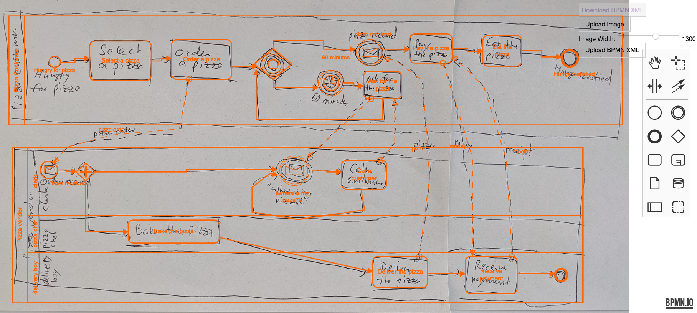

# UML Image Annotator
This fork aims to extend the [bpmn-image-annotator](https://github.com/dwslab/bpmn-image-annotator) in order to provide a toolkit to annotate hand-sketched UML class diagrams.

## Installation
Check out [installation instructions of original repository](#original-installation).

## Workflow

1. Upload image of hand-sketched UML class diagram
2. Model UML-class diagram over the image
3. Download BPMN XML with custom UML elements
4. Optional: To convert BPMN XML files and corresponding images into a [COCO](https://cocodataset.org/#format-data) dataset, check out [pybmn-uml](https://github.com/LiSSA-Approach/pybpmn-uml)

## Custom UML modeler for bpmn-js

This [UML extension](./app/uml-extension) provides a [custom UML modeler](./app/uml-extension/modeler/UmlModeler.js) that allows the creation of UML class diagram elements in bpmn-js. It replaces the [custom modeler](./app/custom-modeler) from the [bpmn-image-annotator](https://github.com/dwslab/bpmn-image-annotator). By changing `MODE` from `Mode.UML_CLASS` to `Mode.BPMN` in [Settings](./app/uml-extension/utils/Settings.js), it is still possible to use the original [custom modeler](./app/custom-modeler) in order to annotate BPMN images the same way as before.

The UML modeler consists of the following modules:

- [UmlContextPadProvider](./app/uml-extension/modeler/modules/UmlContextPadProvider.js): Decides which actions are executable from each UML element's context pad.
- [UmlPaletteProvider](./app/uml-extension/modeler/modules/UmlPaletteProvider.js): Decides which UML elements can be created from palette.
- [UmlRenderer](./app/uml-extension/modeler/modules/UmlRenderer.js): Defines how UML elements are drawn.
- [UmlRules](./app/uml-extension/modeler/modules/UmlRules.js): Defines how UML elements can be used.
- [UmlFactory](./app/uml-extension/modeler/modules/UmlFactory.js): Defines minor changes in element creation and storage.
- [UmlResizeBehavior](./app/uml-extension/modeler/modules/uml-modeling-behavior/UmlResizeBehavior.js): Allows changing resize behavior for custom UML elements.

## README of original repository - BPMN Image Annotator




Annotation tool based on [bpmn-js](https://github.com/bpmn-io/bpmn-js) to annotate hand-drawn BPMN images with their ground-truth BPMN models.

Workflow:
1. Upload image
2. Model BPMN process over the image
3. Download BPMN XML

The XML will have an additional `backgroundSize` to track the width the image was rescaled to during modeling.
This way, the BPMN shapes and edges can be linked back to the position within the image.

`bpmn-js` enforces several correctness rules.
To allow the annotation of images that contain modeling errors, most of these rules have been disabled.
More details can be found in later sections.

<a name="original-installation"></a>
### Installation


```
npm install
npm run dev
```

### Modeling Changes

- allow resizing elements
- allow elements outside of lane/pool (this can be achieved by shrinking lane after the element has been modeled)

### Rule Changes

Sequence Flow:
- (Message/Timer) End Event: allow outgoing sequence flow
- (Message/Timer) Start Event: allow incoming sequence flow
- Event-based Gateway: allow outgoing sequence flow to task

Message Flow:
- Event (all types): allow incoming+outgoing message flow
- Gateway (all types): allow incoming+outgoing message flow
- CallActivity: allow incoming/outgoing message flow

DataInputAssociation/DataOutputAssociation
- allow DataInputAssociation/DataOutputAssociation to catch/throwEvent
- allow DataInputAssociation/DataOutputAssociation to Gateway

### TODO

- new DataInputAssociation/DataOutputAssociation are serialized but not parsed
- allow multiple event-based gateway sources for intermediateMessageReceiveEvent
- less hacky miminum lane dimension configuration: https://forum.bpmn.io/t/change-minimum-lane-dimensions/5318/2

### License

Apache 2.0

Also see the [bpmn-js](https://github.com/bpmn-io/bpmn-js) license.
